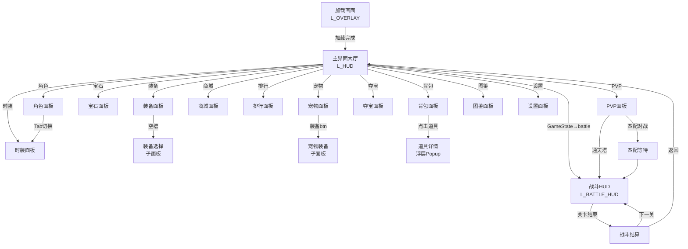

# UI 导航关系图 — nxxhnm v2.0

> Requires: ui_theme.md, ui_architecture.md

---

## 主导航流程

---

## 面板入口/出口表

| # | 面板 | 入口(从哪来) | 出口(去哪) | 返回行为 |
|---|------|-------------|-----------|---------|
| 1 | 主界面 | Loading完成 / BattleResult返回 | 12个功能按钮 / GameState→battle | 根面板,无返回 |
| 2 | 战斗HUD | GameState→battle/pvp/boss | BattleResult | GameState控制,非手动 |
| 3 | 角色面板 | 主界面[角色] / 弹幕"查角色" | Tab→时装 / Back→主界面 | Pop→主界面 |
| 4 | 装备面板 | 主界面[装备] | 空槽→选择列表 / Back→主界面 | Pop→主界面 |
| 5 | 宝石面板 | 主界面[宝石] | Back→主界面 | Pop→主界面 |
| 6 | 宠物面板 | 主界面[宠物] / 弹幕"查战宠" | [装备]→宠物装备子面板 / Back→主界面 | Pop→主界面 |
| 7 | 时装面板 | 主界面[时装] / 角色面板Tab | Back→来源面板 | Pop→来源 |
| 8 | 商城面板 | 主界面[商城] | Back→主界面 | Pop→主界面 |
| 9 | 排行面板 | 主界面[排行] | Back→主界面 | Pop→主界面 |
| 10 | PVP面板 | 主界面[PVP] | [通天塔]→战斗 / [匹配]→匹配等待 / Back→主界面 | Pop→主界面 |
| 11 | 夺宝面板 | 主界面[夺宝] / 99币礼物触发 | Back→主界面 | Pop→主界面 |
| 12 | 背包面板 | 主界面[背包] / 弹幕"查背包" | 点击道具→详情浮层 / Back→主界面 | Pop→主界面 |
| 13 | 图鉴面板 | 主界面[图鉴] | Back→主界面 | Pop→主界面 |
| 14 | 设置面板 | 主界面[设置] | Back→主界面 | Pop→主界面 |
| 15 | 弹幕提示条 | 常驻(不入栈) | — | 不可关闭 |
| 16 | 加载画面 | 启动/场景切换 | 加载完成→隐藏 | 不入栈 |
| 17 | 战斗结算 | battle_end | [下一关]→BattleHUD / [返回]→主界面 | 不入栈,直接响应按钮 |
| 18 | 确认弹窗 | 任何消耗操作 | [确认]/[取消]/遮罩点击 | 不入栈,Popup层 |
| 19 | Toast | 任何提示 | 自动消失 | 不入栈 |
| 20 | 礼物特效 | 收到礼物 | 自动消失 | 不入栈,穿透 |
| 21 | 网络断连 | 断连>3s | 重连成功→隐藏 | 不入栈,Overlay层 |

---

## 弹幕指令→面板映射

| 弹幕指令 | 打开面板 | 备注 |
|---------|---------|------|
| "加入" | 无(执行加入逻辑) | Toast显示"已加入战斗" |
| "查角色" | Character | 显示发送者的角色数据 |
| "查背包" | Inventory | 显示发送者的道具列表 |
| "查战宠" | Pet | 显示发送者的宠物数据 |
| "开箱子" | Lottery | 需有夺宝券道具 |

---

## 子面板关系

| 父面板 | 子面板 | Sort Order | 触发 |
|--------|--------|-----------|------|
| Equipment | EquipSelectList | L_PANEL+2 (22) | 点击空槽位 |
| Pet | PetEquipPanel | L_PANEL+2 (22) | 点击[装备]按钮 |
| Inventory | ItemDetailPopup | L_POPUP (30) | 点击道具 |
| Lottery | PrizeResultPopup | L_POPUP (30) | 抽奖结束 |
